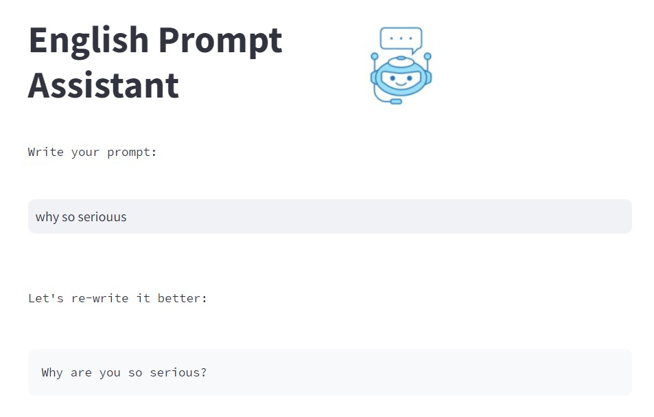

# (English) Prompt Assistant (Streamlit (Python) + OpenAI API)

### This app rephrases your prompts, corrects misspellings, and fixes typos (using OpenAI's GPT-3.5 model).

### **Note**: use your OWN ```OPENAI_API_KEY``` environment variable. For details, please follow **step 2** in: [https://platform.openai.com/docs/quickstart](https://platform.openai.com/docs/quickstart)

